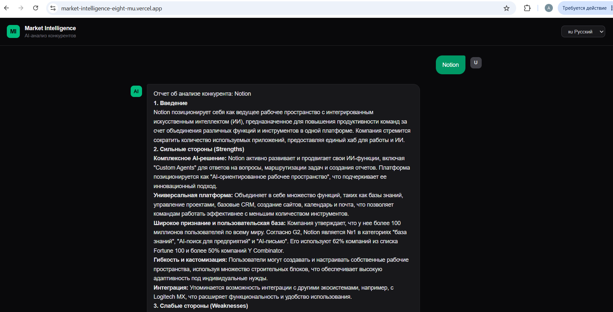

# Market Intelligence Agent 🔍

> AI-ассистент для анализа конкурентов: сайт + новости + отзывы → SWOT-отчёт за 2 минуты.

## 🌐 Live Demo

**Фронтенд:** https://market-intelligence-eight-mu.vercel.app

**API:** https://project26capstone-production.up.railway.app/health

## 📸 Скриншот



## 🚀 Быстрый старт

```bash
# Клонировать репозиторий
git clone https://github.com/anarnur/project_26_capstone.git
cd project_26_capstone

# Настроить переменные окружения
cp .env.example .env
# Заполните .env своими ключами

# Запустить через Docker
docker-compose up
```

После запуска:
- Фронтенд: http://localhost:3000
- API: http://localhost:8000/docs

## 🧠 Архитектура

```
Пользователь → Next.js → FastAPI → Orchestrator (LangGraph)
                                        ↙         ↓        ↘
                                 Researcher   Reviews    Analyst
                                    ↓            ↓          ↓
                               WebScraper   Reddit     SWOT Report
                               NewsSearch   Trustpilot
```

**Агенты:**
- **Orchestrator** — принимает решения, управляет потоком
- **Researcher** — собирает данные с сайта и новости
- **Reviews** — ищет отзывы на Reddit, G2, Trustpilot
- **Analyst** — формирует SWOT-анализ

## 🛠 Стек технологий

| Слой | Технология |
|---|---|
| Агент | LangGraph |
| LLM | Gemini 2.5 Flash |
| Backend | FastAPI + SSE streaming |
| Frontend | Next.js + Tailwind CSS |
| Deploy Backend | Railway |
| Deploy Frontend | Vercel |
| Container | Docker |

## 🔧 Кастомные инструменты

| Инструмент | Описание |
|---|---|
| `WebScraperTool` | Парсит сайт конкурента (BeautifulSoup + httpx) |
| `NewsSearchTool` | Ищет новости за N дней (NewsAPI) |
| `ReviewsScraperTool` | Собирает отзывы с G2 и Trustpilot |
| `RedditSearchTool` | Ищет обсуждения на Reddit (без API ключа) |

## 📡 API Endpoints

| Метод | Endpoint | Описание |
|---|---|---|
| `GET` | `/health` | Статус сервиса |
| `POST` | `/chat` | Запрос анализа (SSE streaming) |

**Пример запроса:**
```bash
curl -X POST https://project26capstone-production.up.railway.app/chat \
  -H "Content-Type: application/json" \
  -d '{"company": "Notion", "language": "Russian"}'
```

## 📁 Структура проекта

```
project-26-capstone/
├── backend/
│   ├── app/
│   │   ├── main.py          # FastAPI entry point
│   │   ├── agents/          # LangGraph агент
│   │   └── tools/           # Кастомные инструменты
│   └── tests/               # Интеграционные тесты
├── frontend/
│   └── app/
│       └── page.tsx         # Next.js интерфейс
├── docs/
│   ├── proposal.md          # Описание проекта
│   └── architecture.svg     # Архитектурная диаграмма
├── Dockerfile
└── docker-compose.yml
```

## 🧪 Тесты

```bash
pytest backend/tests/test_main.py -v
# 7 passed
```

## ⚙️ Переменные окружения

```env
GOOGLE_API_KEY=        # Gemini API ключ
NEWS_API_KEY=          # NewsAPI ключ
SERP_API_KEY=          # SerpAPI ключ (опционально)
```

## ⚠️ Известные ограничения

- NewsAPI: 100 запросов/день на бесплатном тарифе
- G2 и Trustpilot блокируют парсеры — используется Reddit как fallback
- Gemini 2.5 Flash: 20 запросов/день на бесплатном тарифе

## 🗺 План развития

- Подписка на мониторинг — еженедельный дайджест по конкурентам
- Сравнение нескольких конкурентов на одном экране
- Интеграция с Telegram для уведомлений
- RAG-слой для хранения истории анализов